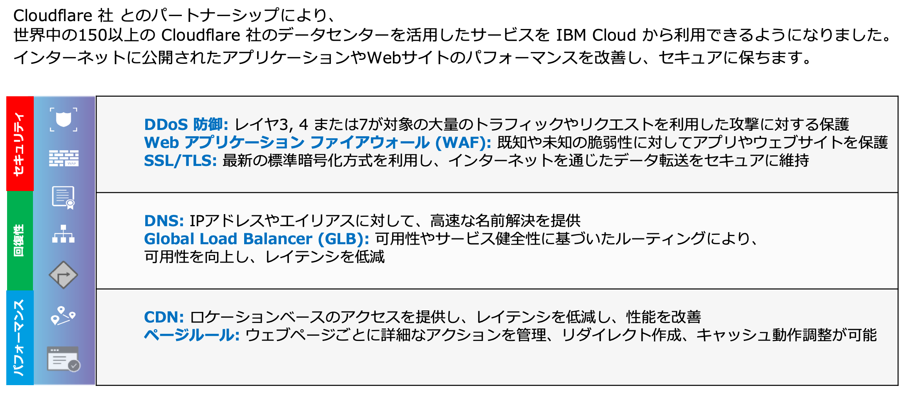
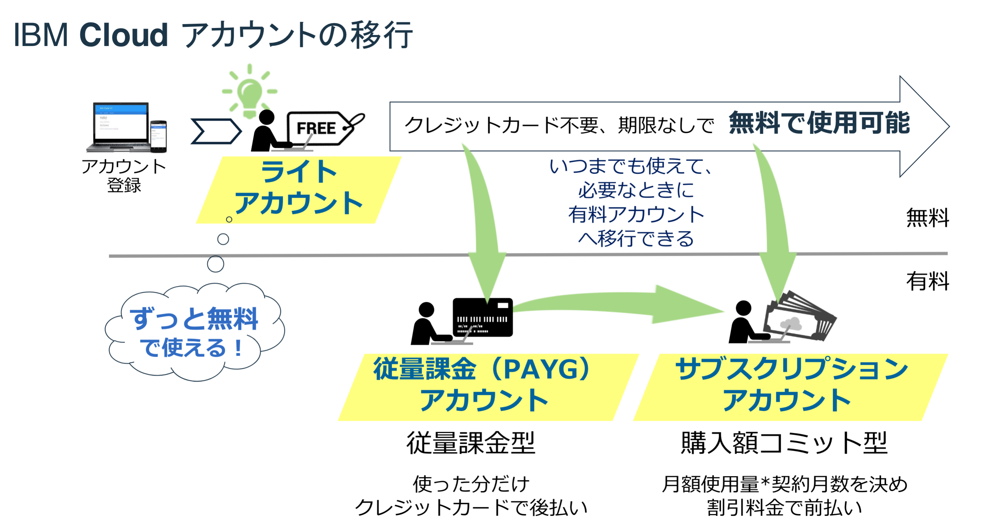
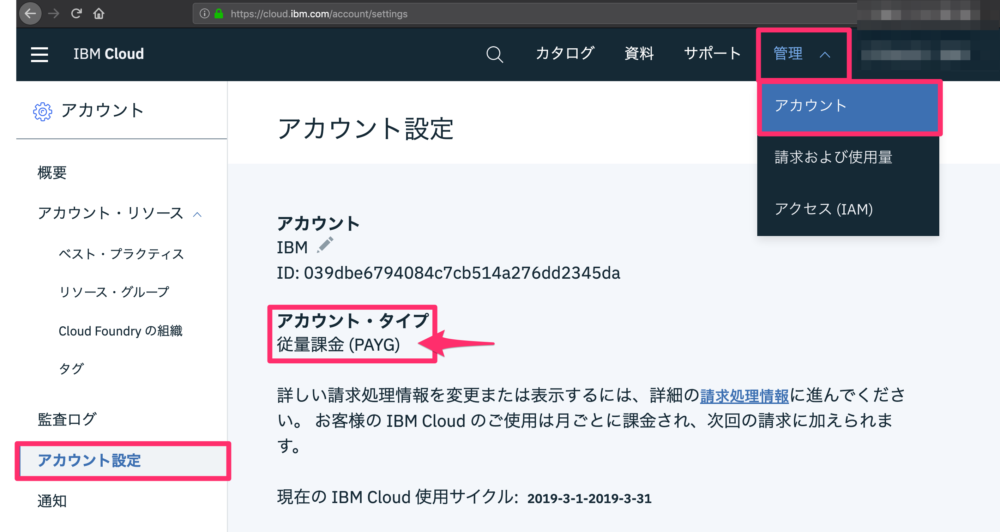
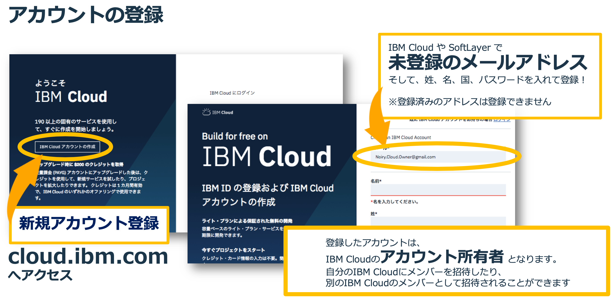
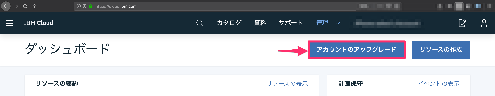
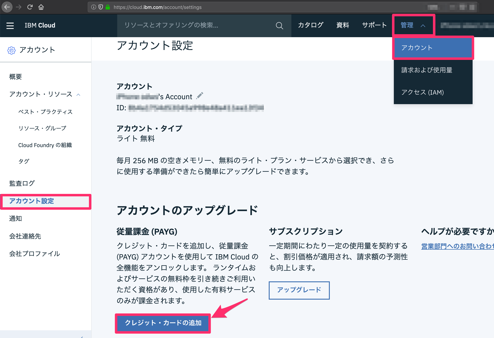

[IBM Cloud Internet Services (CIS) 体験セミナー（無償ハンズオン）～セキュアで高いパフォーマンスをお手軽に実現～](https://www-01.ibm.com/events/wwe/japan/ASJapan.nsf/registration.xsp?open&seminar=FCC3NUES&locale=ja_JP) で実施するハンズオンのガイドです。

# ハンズオン概要

お客様の IBM Cloud アカウント（「トライアル」「従量課金 (PAYG) 」「サブスクリプション」タイプ）を使用して、CIS の設定、運用を体験いただけます。テスト用のWebサイトのセットアップもご紹介しますので、継続的に評価頂けるだけでなく、Web アプリのデプロイ手法も学べます。

本ハンズオンは、仮想サーバー、物理サーバー、コンテナ環境を問わず、インターネットからアクセスできる Web アプリケーションのシステム設計、開発、運用およびセキュリティーご担当者様向けに有用な内容です。

0. [事前準備](#事前準備)
1. a
2. a
3. a
4. a
5. a
6. a
7. a

# CIS (IBM Cloud Internet Services) とは

企業が公開しているWeb アプリケーションに対して、個別にDDoS対策やWAFなどのセキュリティを施し、CDNを活用してWebサイトのパフォーマンスを向上させ、グローバル・ロードバランサーの採用により耐障害性を備えることは、容易でありません。

 IBM Cloud が提供する「IBM Cloud Internet Services（CIS）」は、それらのニーズにお応えできる、お手軽な価格で、非常に使い勝手のよいサービスです。

> IBM Cloud Docs（公式ドキュメント）：[About IBM Cloud Internet Services (CIS)](https://cloud.ibm.com/docs/infrastructure/cis/about.html#about-ibm-cloud-internet-services)

# 事前準備

## 「アカウント・タイプ」とは

お客様の IBM Cloud アカウント（「トライアル」「従量課金 (PAYG) 」「サブスクリプション」タイプ）で、CISサービスの30日無料トライアルを使用してハンズオンを行います。

## 「アカウント・タイプ」の確認

お客様の IBM Cloud アカウントの状況を確認し、以下のガイドに従ってご準備いただき、ご参加ください。

アカウントタイプは、 <https://cloud.ibm.com/account/settings>（管理 ＞ アカウント ＞ アカウント設定）の「アカウント・タイプ」からご確認いただけます。

## アカウント・タイプごとの準備事項

- [(1) IBM Cloud アカウントをお持ちでないお客様](#(1) IBM Cloud アカウントをお持ちでないお客様)
- [(2) IBM Cloud アカウントタイプが「ライト(無料)」のお客様](#(2) IBM Cloud アカウントタイプが「ライト(無料)」のお客様) 
- [(3) すでに IBM Cloud アカウントが「トライアル」「従量課金 (PAYG) 」「サブスクリプション」タイプのお客様](#(3) すでに IBM Cloud アカウントが「トライアル」「従量課金 (PAYG) 」「サブスクリプション」タイプのお客様) 

### (1) IBM Cloud アカウントをお持ちでないお客様

[https://cloud.ibm.com/registration/](https://cloud.ibm.com/registration/) から IBM Cloud アカウント（「ライト(無料)」）を作成してください。
その後、アカウント・タイプが「ライト(無料)」であることを確認し、[(2)](#(2) IBM Cloud アカウントタイプが「ライト(無料)」のお客様) の案内に従ってください。

### (2) IBM Cloud アカウントタイプが「ライト(無料)」のお客様

IBM Cloud アカウントタイプを「従量課金 (PAYG) 」にアップグレードしてください。
<u>クレジットカードを登録いただくことで、「従量課金 (PAYG) 」へアップグレードできます。</u>
その後、アカウント・タイプが「従量課金 (PAYG)」であることを確認し、[(3)](# (3) すでに IBM Cloud アカウントが「トライアル」「従量課金 (PAYG) 」「サブスクリプション」タイプのお客様) の案内に従ってください。

「ライト」から「従量課金 (PAYG) 」にアップグレードするには、
「ダッシュボード」画面から「アカウントのアップグレード」をクリックする、

もしくは「アカウント設定」<https://cloud.ibm.com/account/settings> に進み、「クレジット・カードの追加」をクリックします。

> 「従量課金 (PAYG) 」では、有償プランを含む IBM Cloud の全サービスをご利用いただけます。
> 「従量課金 (PAYG) 」にアップグレードすると 30 日間有効な $200 のクレジットが渡され、アカウントの請求に自動的に適用されます。（このクレジットを、サード・パーティーのオファリングで使用することはできません。）

### (3) すでに IBM Cloud アカウントが「トライアル」「従量課金 (PAYG) 」「サブスクリプション」タイプのお客様

過去に CIS の30 日間の無料トライアルが終了してないかをご確認ください。
すでに CIS の30 日間の無料トライアルが終了したアカウントのお客様は、CIS 標準プラン(月額￥28,100/ドメイン) をご購入いただくか、上記 [(1)](#(1) IBM Cloud アカウントをお持ちでないお客様) [(2)](# (2) IBM Cloud アカウントタイプが「ライト(無料)」のお客様) の案内に従って新規にアカウントをご用意ください。

# その他ご参考リンク
[IBM Cloud よくあるご質問（FAQ）](https://www.ibm.com/jp-ja/cloud/info/cloud-jp-faq)をご用意しております。
これらの FAQ をご参照いただき、回答をご確認ください。
