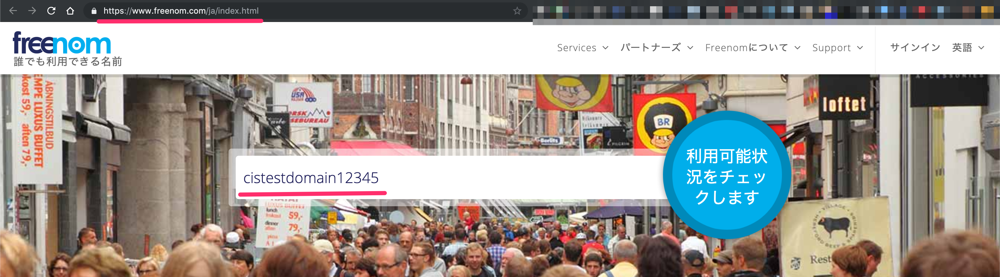
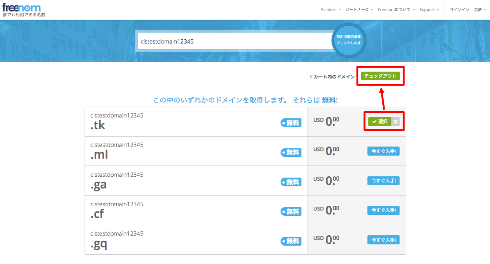
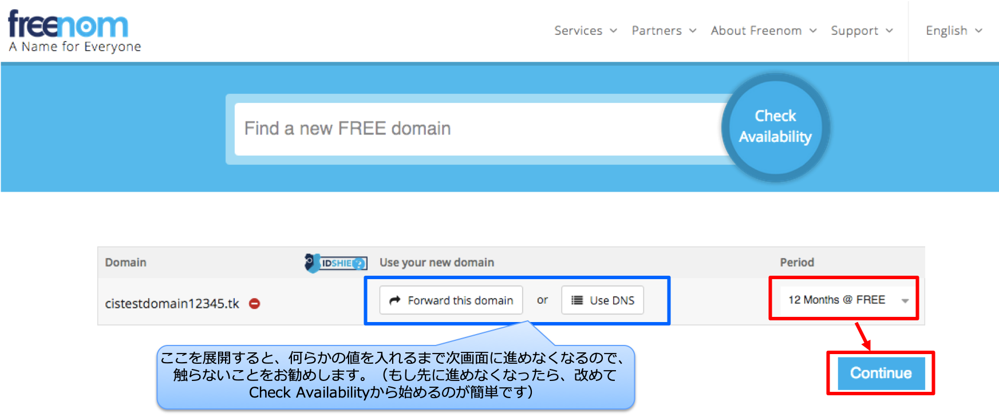
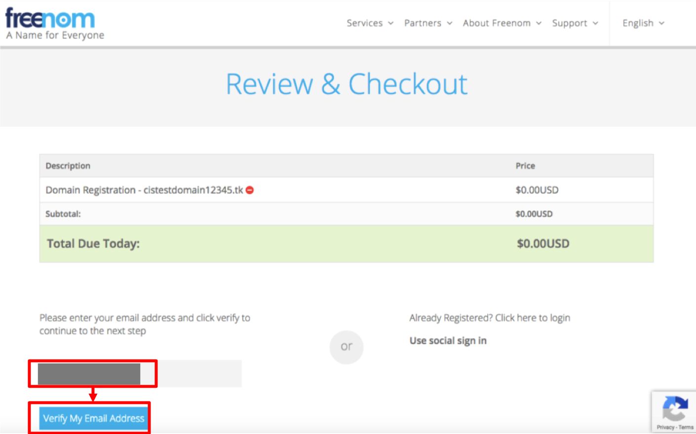
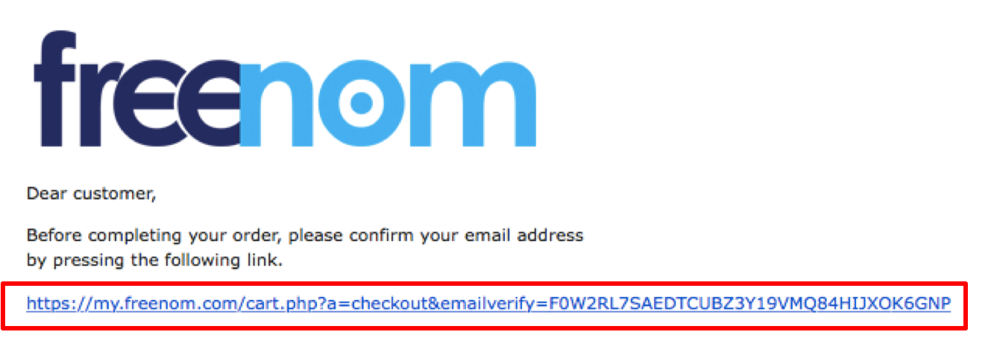
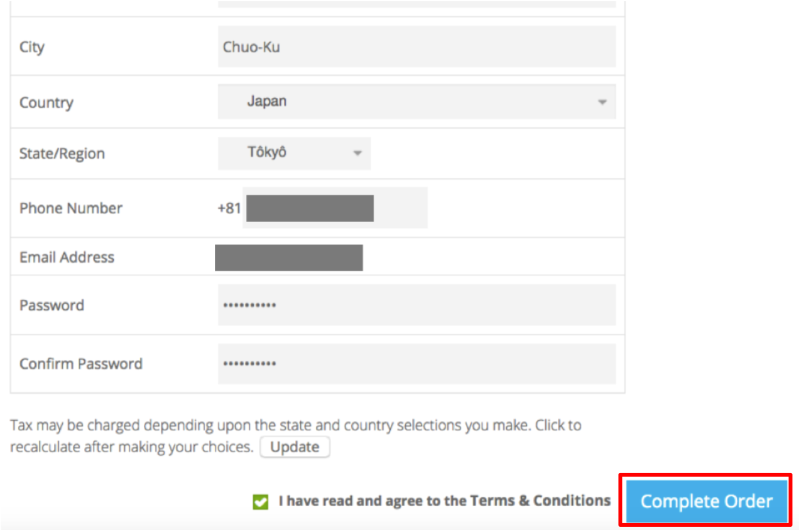
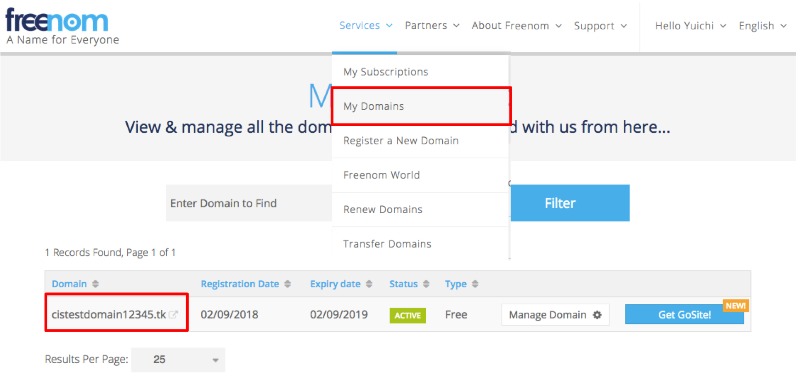

# テスト用無料ドメインの取得手順

freenom というサービスでCISテスト用のドメインを無料で取得する手順をご紹介します。

1. https://www.freenom.com/ja/index.html にアクセスし、任意のドメイン名を入力し、利用可能状況をチェックのボタンを押下します。
   
2. .tk, .ml, .ga, .cf, .gq のドメインは無料で取得できます。取得したいドメインの「今すぐ入手！」ボタンを押し、選択された状態にしてからチェックアウトボタンを押下します。
   
3. 必要に応じて期間を変更し、Continueボタンを押下します。
   
4. メールアドレスを入力し、「Verify My Email Address」を押下します。
   
5. 入力したメールアドレスに、確認用のメールが送信された旨のメッセージが表示されます。
   入力したメールアドレスにメールが届いているので、メール内のリンクをクリックします。
   
6. メールのリンクをクリックすると、ユーザー情報の入力画面が開きます。
   入力し、ページ下部の「Complete Order」ボタンを押下します。
   
7. オーダーが完了したら、メニューの、Services > My Domains から、取得したドメインの設定画面を表示できます。
   
